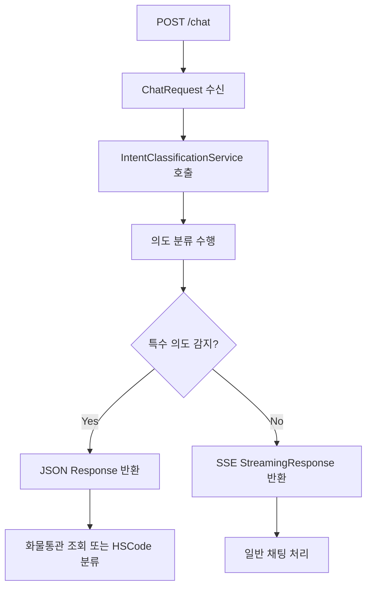

# Chat 엔드포인트 구현 가이드

## 📋 개요

파이썬 서버의 `/api/v1/chat` 엔드포인트 응답 형식에 맞게 Spring Boot 3.5+ 서버를 구현했습니다.

## 🔄 구현된 흐름



## 🏗️ 구현된 구조

### 1. **새로운 DTO 클래스**

#### 화물통관 조회 응답
```java
// src/main/java/com/hscoderadar/domain/chat/dto/response/CargoTrackingResponse.java
@Builder
public record CargoTrackingResponse(
    @JsonProperty("intent_type") String intentType,
    String status,
    String message,
    @JsonProperty("cargo_data") CargoData cargoData,
    // ... 기타 필드들
)
```

#### HSCode 분류 응답
```java
// src/main/java/com/hscoderadar/domain/chat/dto/response/HsCodeClassificationResponse.java
@Builder
public record HsCodeClassificationResponse(
    String type,
    String service,
    String stage,
    String message,
    ClassificationResult result,
    // ... 기타 필드들
)
```

#### 의도 분류 결과
```java
// src/main/java/com/hscoderadar/domain/chat/dto/response/IntentClassificationResult.java
@Builder
public record IntentClassificationResult(
    String intentType,
    Double confidence,
    Object extractedData
)
```

### 2. **의도 분류 서비스**

```java
// src/main/java/com/hscoderadar/domain/chat/service/IntentClassificationService.java
@Service
public class IntentClassificationService {
    
    @Cacheable(value = "intentClassification")
    public Mono<IntentClassificationResult> classifyIntent(String message) {
        // 파이썬 서버와 통신하여 의도 분류 수행
    }
}
```

### 3. **업데이트된 ChatController**

```java
// src/main/java/com/hscoderadar/domain/chat/controller/ChatController.java
@RestController
public class ChatController {
    
    @PostMapping
    public Mono<ResponseEntity<?>> handleChat(
            @Valid @RequestBody ChatRequest request,
            @AuthenticationPrincipal UserDetails userDetails) {
        
        // 1. 의도 분류 수행
        return intentClassificationService.classifyIntent(request.message())
                .flatMap(intentResult -> {
                    // 2. 특수 의도인 경우 JSON 응답
                    if (intentResult.requiresJsonResponse()) {
                        return handleSpecialIntent(intentResult, request, userId);
                    }
                    // 3. 일반 채팅인 경우 SSE 스트리밍
                    return handleGeneralChat(request, userId);
                });
    }
}
```

## 🎯 응답 형식

### 1. **JSON Response (특수 의도)**

#### 화물통관 조회 성공
```json
{
  "intent_type": "cargo_tracking",
  "status": "success",
  "message": "화물번호 'ABCD1234567'을(를) 인식했습니다. 통관 정보를 조회하고 있습니다.",
  "cargo_data": {
    "cargo_number": "ABCD1234567",
    "cargo_type": "컨테이너",
    "extracted_patterns": ["container"],
    "confidence_score": 0.95
  },
  "spring_endpoint": "/api/cargo/tracking",
  "session_uuid": "f8a67849-309e-41dd-af9a-77c0b861ec03",
  "user_id": 4,
  "processed_at": "2025-07-06T12:39:43.632Z",
  "processing_time_ms": 250
}
```

#### HSCode 분류 정보 요청
```json
{
  "type": "information_request",
  "service": "hscode_classification",
  "stage": "information_gathering",
  "message": "안녕하세요! 😊 HSCode 분류를 도와드리겠습니다...",
  "next_stage": "classification",
  "timestamp": "2025-07-06T12:39:43.629Z",
  "session_uuid": "f8a67849-309e-41dd-af9a-77c0b861ec03",
  "user_id": 4,
  "processing_time_ms": 1500
}
```

### 2. **SSE Streaming Response (일반 채팅)**

```
event: session_info
data: {"session_uuid": "f8a67849-309e-41dd-af9a-77c0b861ec03", "timestamp": 1720263584.2559748}

event: message_start
data: {"type": "message_start", "message": {"id": "chatcompl_a59ab9545bf64cd7b91afd27", ...}}

event: content_block_delta
data: {"type": "content_block_delta", "index": 0, "delta": {"type": "text_delta", "text": "안녕하세요! "}}

event: message_stop
data: {"type": "message_stop"}
```

## 🔧 설정 및 기능

### 1. **캐시 설정**
- 의도 분류 결과를 24시간 캐싱
- 최대 10,000개 항목 저장
- Caffeine 캐시 사용

### 2. **에러 처리**
- 의도 분류 실패 시 일반 채팅으로 폴백
- 화물 번호 미발견 시 구체적인 에러 응답
- 타임아웃 설정 (15초)

### 3. **헤더 설정**
- JSON 응답: `Content-Type: application/json`
- SSE 응답: `Content-Type: text/event-stream`
- 적절한 CORS 및 캐시 헤더 설정

## 🚀 사용 방법

### 1. **화물통관 조회 테스트**
```bash
curl -X POST http://localhost:8080/chat \
  -H "Content-Type: application/json" \
  -d '{"message": "ABCD1234567 화물 조회해줘", "session_uuid": null}'
```

### 2. **HSCode 분류 테스트**
```bash
curl -X POST http://localhost:8080/chat \
  -H "Content-Type: application/json" \
  -d '{"message": "스마트폰 HSCode 알려줘", "session_uuid": null}'
```

### 3. **일반 채팅 테스트**
```bash
curl -X POST http://localhost:8080/chat \
  -H "Content-Type: application/json" \
  -H "Accept: text/event-stream" \
  -d '{"message": "안녕하세요", "session_uuid": null}'
```

## ⚡ 성능 최적화

1. **의도 분류 캐싱**: 동일한 메시지에 대한 반복 처리 방지
2. **비동기 처리**: Reactive Streams를 사용한 논블로킹 처리  
3. **타임아웃 설정**: 응답 지연 방지
4. **에러 복구**: 실패 시 자동 폴백 메커니즘

## 🔍 모니터링

- 의도 분류 결과 및 신뢰도 로깅
- 처리 시간 측정 및 기록
- 에러 발생 시 상세 로그 출력
- 캐시 히트율 모니터링 가능

## 📝 주의사항

1. **파이썬 서버 의존성**: 의도 분류를 위해 파이썬 서버와 통신 필요
2. **캐시 만료**: 24시간 후 캐시가 만료되므로 주기적인 갱신 발생
3. **메모리 사용량**: 최대 10,000개 캐시 항목으로 메모리 사용량 관리
4. **네트워크 타임아웃**: 파이썬 서버 응답 지연 시 폴백 처리

---

✅ **구현 완료**: 파이썬 서버 응답 형식에 완벽히 대응하는 Spring Boot 서버가 구현되었습니다! 