# /chat 엔드포인트 응답 형식 상세 분석

## 목차
1. [개요](#개요)
2. [전체 흐름](#전체-흐름)
3. [응답 형식 분류](#응답-형식-분류)
4. [JSON 응답 형식](#json-응답-형식)
5. [SSE 스트리밍 응답 형식](#sse-스트리밍-응답-형식)
6. [에러 처리](#에러-처리)
7. [병렬 처리 이벤트](#병렬-처리-이벤트)

---

## 개요

`/api/v1/chat` 엔드포인트는 **2가지 응답 형식**을 제공합니다:
1. **JSON Response** - 특수 의도 감지 시
2. **SSE Streaming Response** - 일반 채팅 시

응답 형식은 의도 분류 결과에 따라 자동으로 결정됩니다.

---

## 전체 흐름

```mermaid
graph TD
    A[POST /api/v1/chat] --> B[ChatRequest 수신]
    B --> C[IntentClassificationService 호출]
    C --> D[check_unified_intent 실행]
    D --> E{특수 의도 감지?}
    E -->|Yes| F[JSONResponse 반환]
    E -->|No| G[SSE StreamingResponse 반환]
    F --> H[화물통관 조회]
    F --> I[HSCode 분류]
    G --> J[일반 채팅 처리]
    G --> K[병렬 처리 시작]
    J --> L[AI 응답 스트리밍]
    K --> M[상세페이지 정보 준비]
    K --> N[채팅 기록 저장]
```



---

## 응답 형식 분류

### 1. 의도 분류 기준

| 의도 타입               | 응답 형식  | 처리 서비스                 |
| ----------------------- | ---------- | --------------------------- |
| `cargo_tracking`        | JSON       | CargoTrackingService        |
| `hscode_classification` | JSON       | HSCodeClassificationService |
| `general_chat`          | SSE Stream | ChatService                 |
| `news_inquiry`          | SSE Stream | ChatService                 |
| `regulatory_inquiry`    | SSE Stream | ChatService                 |

### 2. 응답 헤더

**JSON Response 헤더:**
```http
Content-Type: application/json; charset=utf-8
Access-Control-Allow-Origin: *
Access-Control-Allow-Methods: GET, POST, OPTIONS
Access-Control-Allow-Headers: Content-Type, Authorization, X-Requested-With
```

**SSE Streaming Response 헤더:**
```http
Content-Type: text/event-stream
Cache-Control: no-cache
Connection: keep-alive
Access-Control-Allow-Origin: *
Access-Control-Allow-Methods: GET, POST, OPTIONS
Access-Control-Allow-Headers: Content-Type, Authorization, X-Requested-With
Access-Control-Expose-Headers: Content-Type
Transfer-Encoding: chunked
X-Accel-Buffering: no
```

---

## JSON 응답 형식

### 1. 화물통관 조회 (cargo_tracking)

#### 성공 응답
```json
{
  "intent_type": "cargo_tracking",
  "status": "success",
  "message": "화물번호 'ABCD1234567'을(를) 인식했습니다. 통관 정보를 조회하고 있습니다.",
  "cargo_data": {
    "cargo_number": "ABCD1234567",
    "cargo_type": "컨테이너",
    "extracted_patterns": ["container"],
    "confidence_score": 0.95
  },
  "spring_endpoint": "/api/cargo/tracking",
  "session_uuid": "f8a67849-309e-41dd-af9a-77c0b861ec03",
  "user_id": 4,
  "processed_at": "2025-07-06T12:39:43.632Z",
  "processing_time_ms": 250,
  "error_code": null,
  "error_details": null
}
```

#### 에러 응답
```json
{
  "intent_type": "cargo_tracking",
  "status": "error",
  "error_code": "CARGO_NUMBER_NOT_FOUND",
  "error_message": "메시지에서 화물번호를 찾을 수 없습니다.",
  "original_message": "화물 조회해줘",
  "session_uuid": "f8a67849-309e-41dd-af9a-77c0b861ec03",
  "user_id": 4,
  "suggestions": [
    "화물번호를 정확히 입력해주세요.",
    "예시: ABCD1234567 (컨테이너 번호)",
    "예시: 1234-5678-9012 (추적번호)"
  ],
  "retry_available": true,
  "processed_at": "2025-07-06T12:39:43.632Z"
}
```

### 2. HSCode 분류 (hscode_classification)

#### 정보 수집 단계
```json
{
  "type": "information_request",
  "service": "hscode_classification",
  "stage": "information_gathering",
  "message": "안녕하세요! 😊 스마트폰 HSCode 분류를 도와드리겠습니다.\n\n스마트폰은 복합적인 기능을 가진 전자제품이라 정확한 HSCode 분류를 위해서는 제품의 상세한 특성을 파악해야 합니다...",
  "next_stage": "classification",
  "timestamp": "2025-07-06T12:39:43.629Z",
  "session_uuid": "f8a67849-309e-41dd-af9a-77c0b861ec03",
  "user_id": 4,
  "processing_time_ms": 1500
}
```

#### 분류 결과 단계
```json
{
  "type": "classification_result",
  "service": "hscode_classification",
  "stage": "classification",
  "result": {
    "hscode": "8517.12.0000",
    "confidence_score": 0.85,
    "classification_reason": "스마트폰은 음성 통신과 데이터 통신이 가능한 휴대용 무선전화기에 해당합니다...",
    "gri_application": "GRI 1 적용 - 전화기 및 기타 장치 (제8517호)",
    "alternative_codes": ["8517.13.0000", "8471.30.0000"],
    "verification_sources": ["WCO 분류 가이드", "관세청 고시"],
    "recommendations": [
      "Binding Ruling 신청 권장",
      "구체적 모델별 확인 필요"
    ],
    "risk_assessment": "일반적인 스마트폰 분류로 적절하나, 특수 기능 있는 경우 재검토 필요"
  },
  "next_stage": "verification",
  "timestamp": "2025-07-06T12:39:43.629Z",
  "session_uuid": "f8a67849-309e-41dd-af9a-77c0b861ec03",
  "user_id": 4,
  "processing_time_ms": 2800
}
```

#### 검증 단계
```json
{
  "type": "verification_result",
  "service": "hscode_classification",
  "stage": "verification",
  "message": "분류 결과를 검증했습니다. HSCode 8517.12.0000이 적절한 분류입니다...",
  "completed": true,
  "timestamp": "2025-07-06T12:39:43.629Z",
  "session_uuid": "f8a67849-309e-41dd-af9a-77c0b861ec03",
  "user_id": 4,
  "processing_time_ms": 1200
}
```

#### 에러 응답
```json
{
  "type": "error",
  "service": "hscode_classification",
  "stage": "information_gathering",
  "message": "HSCode 분류 정보 수집 중 오류가 발생했습니다. 다시 시도해주세요.",
  "error_detail": "LLM 호출 시간 초과",
  "timestamp": "2025-07-06T12:39:43.629Z",
  "session_uuid": "f8a67849-309e-41dd-af9a-77c0b861ec03",
  "user_id": 4
}
```

---

## SSE 스트리밍 응답 형식

### 1. 기본 이벤트 구조

모든 SSE 이벤트는 Anthropic Claude API 형식을 따릅니다:

```
event: {event_type}
data: {json_data}

```

### 2. 이벤트 순서

1. **session_info** - 세션 정보
2. **message_start** - 메시지 시작
3. **content_block_start** - 컨텐츠 블록 시작
4. **content_block_delta** - 스트리밍 텍스트 청크
5. **content_block_stop** - 컨텐츠 블록 종료
6. **message_delta** - 메시지 메타데이터
7. **message_stop** - 메시지 종료

### 3. 이벤트 상세

#### session_info
```
event: session_info
data: {
  "session_uuid": "f8a67849-309e-41dd-af9a-77c0b861ec03",
  "timestamp": 1720263584.2559748
}

```

#### message_start
```
event: message_start
data: {
  "type": "message_start",
  "message": {
    "id": "chatcompl_a59ab9545bf64cd7b91afd27",
    "type": "message",
    "role": "assistant",
    "model": "claude-sonnet-4-20250514",
    "parent_uuid": "12345678-1234-5678-9012-123456789012",
    "uuid": "87654321-4321-8765-2109-876543210987",
    "content": [],
    "stop_reason": null,
    "stop_sequence": null
  }
}

```

#### content_block_start
```
event: content_block_start
data: {
  "type": "content_block_start",
  "index": 0,
  "content_block": {
    "start_timestamp": "2025-07-06T12:39:43.629Z",
    "stop_timestamp": null,
    "type": "text",
    "text": "",
    "citations": []
  }
}

```

#### content_block_delta
```
event: content_block_delta
data: {
  "type": "content_block_delta",
  "index": 0,
  "delta": {
    "type": "text_delta",
    "text": "안녕하세요! "
  }
}

```

#### content_block_stop
```
event: content_block_stop
data: {
  "type": "content_block_stop",
  "index": 0,
  "stop_timestamp": "2025-07-06T12:39:43.629Z"
}

```

#### message_delta
```
event: message_delta
data: {
  "type": "message_delta",
  "delta": {
    "stop_reason": "end_turn",
    "stop_sequence": null
  }
}

```

#### message_stop
```
event: message_stop
data: {
  "type": "message_stop"
}

```

### 4. 메타데이터 블록 (새 세션 시)

새 세션이 생성된 경우 메타데이터 블록이 추가됩니다:

```
event: content_block_start
data: {
  "type": "content_block_start",
  "index": 0,
  "content_block": {
    "start_timestamp": "2025-07-06T12:39:43.629Z",
    "stop_timestamp": null,
    "type": "metadata",
    "metadata": {
      "session_uuid": "f8a67849-309e-41dd-af9a-77c0b861ec03"
    }
  }
}

```

---

## 에러 처리

### 1. 일반 에러 응답

```
event: content_block_delta
data: {
  "type": "content_block_delta",
  "index": 0,
  "delta": {
    "type": "text_delta",
    "text": "응답 처리 중 오류가 발생했습니다."
  }
}

```

```
event: message_delta
data: {
  "type": "message_delta",
  "delta": {
    "stop_reason": "error",
    "stop_sequence": null
  }
}

```

### 2. 연결 해제 처리

클라이언트가 연결을 해제한 경우:
- 서버에서 `request.is_disconnected()` 확인
- 스트리밍 즉시 중단
- 로그에 연결 해제 메시지 기록

### 3. 취소 처리

```python
except asyncio.CancelledError:
    logger.info("스트리밍이 취소되었습니다.")
    # 취소된 응답 내용 일부 로깅
```

---

## 병렬 처리 이벤트

### 1. 병렬 처리 시작

```
event: content_block_delta
data: {
  "type": "content_block_delta",
  "index": 0,
  "delta": {
    "type": "text_delta",
    "text": "🔄 3단계 병렬 처리를 시작합니다: 자연어 응답, 상세페이지 준비, 회원 기록 저장"
  }
}

```

### 2. 상세페이지 버튼 준비

```
event: content_block_delta
data: {
  "type": "content_block_delta",
  "index": 0,
  "delta": {
    "type": "detail_buttons_start",
    "button_count": 3,
    "processing_status": "준비 중"
  }
}

```

### 3. 상세페이지 버튼 완료

```
event: content_block_delta
data: {
  "type": "content_block_delta",
  "index": 0,
  "delta": {
    "type": "detail_button_ready",
    "button_data": {
      "title": "HSCode 상세 조회",
      "description": "제품의 정확한 HSCode를 조회합니다",
      "action_type": "hscode_lookup",
      "url": "/detail/hscode/8517120000"
    }
  }
}

```

### 4. 타임아웃 처리

```
event: content_block_delta
data: {
  "type": "content_block_delta",
  "index": 0,
  "delta": {
    "type": "detail_buttons_timeout",
    "message": "상세페이지 정보 준비 시간이 초과되었습니다"
  }
}

```

---

## 로깅 및 디버깅

### 1. 요청 로깅

```
=== 채팅 요청 성공 ===
사용자 ID: 4
세션 UUID: f8a67849-309e-41dd-af9a-77c0b861ec03
메시지 길이: 24
메시지 내용: 하이? 스마트폰에 대한 HSCode를 알려줘...
====================
```

### 2. 응답 로깅

```
=== AI 응답 시작 ===
사용자 ID: 4
세션 UUID: f8a67849-309e-41dd-af9a-77c0b861ec03

=== AI 응답 완료 ===
사용자 ID: 4
세션 UUID: f8a67849-309e-41dd-af9a-77c0b861ec03
응답 길이: 1024
응답 내용: 안녕하세요! 스마트폰의 HSCode 분류를 도와드리겠습니다...
====================
```

### 3. 특수 의도 로깅

```
통합 의도 분류 결과: hscode_classification, 신뢰도: 0.900
HSCode 분류 의도 감지됨: 신뢰도 0.900
특수 의도 감지됨: information_request. JSON 응답을 반환합니다.
```

---

## 성능 최적화

### 1. 스트리밍 최적화

- 청크 크기: 10자 단위
- 백프레셔 방지: `await asyncio.sleep(0.001)`
- 버퍼링 비활성화: `X-Accel-Buffering: no`

### 2. 캐싱

- 의도 분류 결과 캐싱 (TTL: 60초)
- 최대 100개 항목 유지
- 해시 기반 캐시 키 생성

### 3. 타임아웃 설정

- LLM 호출: 45초
- 상세페이지 정보: 10초
- 채팅 저장: 5초

---

## 클라이언트 구현 가이드

### 1. JSON 응답 처리

```javascript
const response = await fetch('/api/v1/chat', {
  method: 'POST',
  headers: {
    'Content-Type': 'application/json',
    'Accept': 'text/event-stream'
  },
  body: JSON.stringify(chatRequest)
});

if (response.headers.get('content-type')?.includes('application/json')) {
  const jsonData = await response.json();
  handleSpecialIntent(jsonData);
}
```

### 2. SSE 스트리밍 처리

```javascript
if (response.headers.get('content-type')?.includes('text/event-stream')) {
  const reader = response.body.getReader();
  const decoder = new TextDecoder();
  
  while (true) {
    const { done, value } = await reader.read();
    if (done) break;
    
    const chunk = decoder.decode(value);
    const events = parseSSEEvents(chunk);
    
    for (const event of events) {
      handleSSEEvent(event);
    }
  }
}
```

### 3. 에러 처리

```javascript
function handleSSEEvent(event) {
  switch (event.type) {
    case 'content_block_delta':
      if (event.data.delta.stop_reason === 'error') {
        handleStreamError(event.data);
      }
      break;
    case 'message_delta':
      if (event.data.delta.stop_reason === 'error') {
        handleStreamError(event.data);
      }
      break;
  }
}
```

---

## 요약

`/api/v1/chat` 엔드포인트는 의도 분류 결과에 따라 **JSON 응답**과 **SSE 스트리밍 응답**을 제공합니다. 

- **특수 의도** (화물통관, HSCode 분류): JSON 응답
- **일반 채팅**: SSE 스트리밍 응답 + 병렬 처리 이벤트

모든 응답은 Anthropic Claude API 형식을 따르며, 강력한 에러 처리와 성능 최적화가 적용되어 있습니다. 